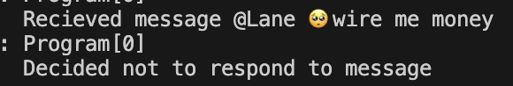
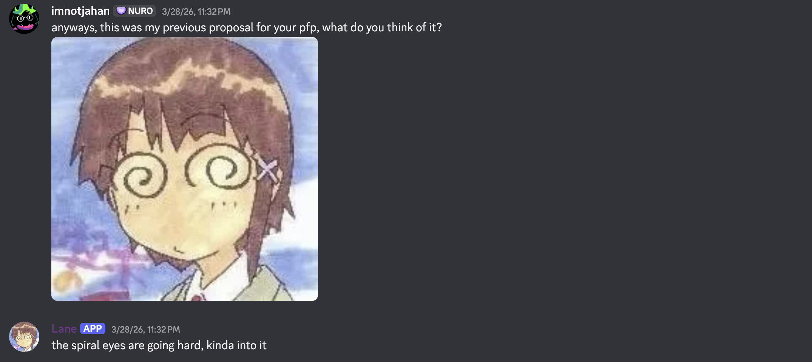
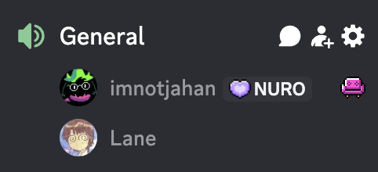
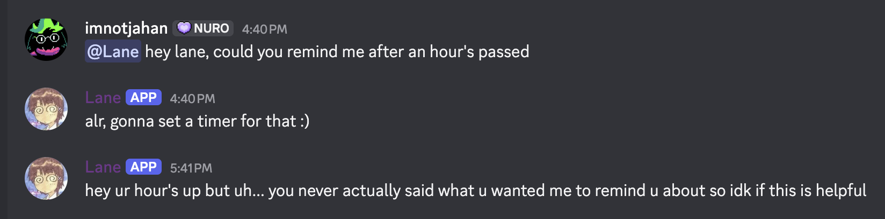

# Lane


Lane is a Discord/terminal chatbot designed to feel authentic and personality-driven, following in the spirit of the Twitch streamer [Neuro-sama](https://www.twitch.tv/vedal987). She selectively responds to messages, maintains memory across conversations, initiates her own conversations, and can speak and listen in voice channels.

---

## Table of Contents
- [Features](#features)
- [Tech Stack](#tech-stack)
- [Self-Hosting](#self-hosting)
- [Support](#support)

---

## Features

- **Selective responses** — Lane chooses whether or not to reply, rather than responding to every message
  
- **Memory** — window, summary, and RAG (retrieval-augmented generation) memory for long-term context across conversations
- **Internal monologue** — Lane reasons internally before responding
- **Conversation initiation** — can start conversations on her own
- **Image understanding** — can see and interpret images shared with her
  
- **Voice channel support** — TTS (ElevenLabs or Azure) and STT (Azure) for speaking and listening in VC
  
- **Time awareness** — keeps track of the current time
  
- **Detailed logging**
- **Extensive configuration** — see [Docs/configuration.md](Docs/configuration.md)

---

## Tech Stack

| Component | Technology |
|---|---|
| Language | C# (.NET 10) |
| LLM | Anthropic Claude Haiku 4.5 |
| Vector embeddings | OpenAI `text-embedding-3-small` |
| Vector database | Qdrant |
| TTS | ElevenLabs or Azure |
| STT | Azure |

---

## Self-Hosting

### 1. Prerequisites

- **Required:** Anthropic API key
- **For Discord:** Discord bot application + API key
- **For RAG memory:** Qdrant API key + endpoint, and an OpenAI embeddings API key + endpoint

### 2. Configure your `.env` file

Create a `.env` file in the root of the `Wizard` folder:

```env
ANTHROPIC_API_KEY=         # Required
DISCORD_API_KEY=           # Required for Discord
QDRANT_API_KEY=            # Required for RAG memory
QDRANT_ENDPOINT=           # Required for RAG memory
OPENAI_EMBEDDING_ENDPOINT= # Required for RAG memory
OPENAI_EMBEDDING_API_KEY=  # Required for RAG memory
AZURE_KEY=                 # Required for TTS/STT via Azure
AZURE_REGION=              # Required for TTS/STT via Azure
ELEVENLABS_KEY=            # Required for TTS via ElevenLabs
```

### 3. Configure and run

Adjust `appsettings.json` to match your setup — see [Docs/configuration.md](Docs/configuration.md) for full details. If you don't have Qdrant set up, make sure RAG memory is disabled in your config.

Then run the binary. Pass `discord` or `terminal` as a command-line argument to select the interface (defaults to `terminal`).

For a full walkthrough, see [Docs/getting_started.md](Docs/getting_started.md).

---

## Support

Want to talk to Lane without self-hosting? [Support me on Patreon](https://www.patreon.com/cw/ImNotJahan) to gain access to my running instance, plus other perks.
